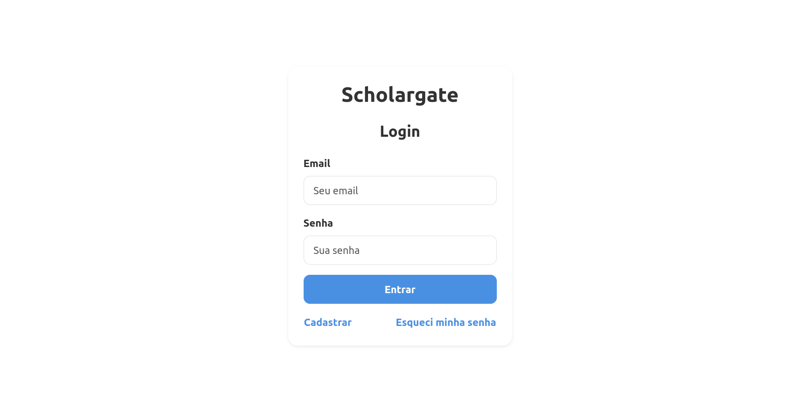
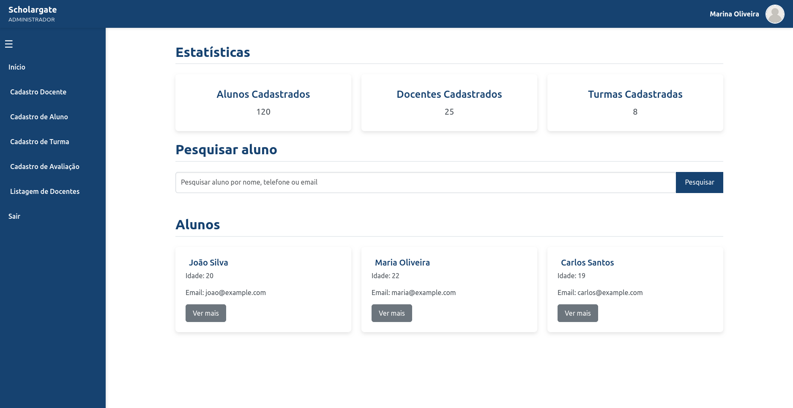

_(Versão Português | [Clique aqui para a versão em Inglês.](https://github.com/barbaracalderon/scholargate/blob/main/README.md))_

# Scholargate

Scholargate é um sistema de gerenciamento acadêmico desenvolvido utilizando Angular, Bootstrap, CSS, componentes standalone e Local Storage para persistência de dados. Este projeto oferece uma plataforma acessível para administradores, docentes e alunos, cada um com funcionalidades e permissões específicas.

Este projeto foi desenvolvido utilizando HTML, CSS, JavaScript, Bootstrap e localStorage para armazenamento de dados. Faz parte de uma atividade individual dentro do currículo do curso Fullstack no SENAI/SC pelo Lab365. O conteúdo exibido está no idioma Português-BR.




## Autor

Barbara Calderon, Desenvolvedora de Software.

- [Github](https://www.github.com/barbaracalderon)
- [LinkedIn](https://www.linkedin.com/in/barbaracalderondev)
- [Twitter](https://www.x.com/bederoni)

## Tabela de Funcionalidades

| **Funcionalidade**        | **Descrição**                                                                                                                                                 |
|---------------------------|---------------------------------------------------------------------------------------------------------------------------------------------------------------|
| **Autenticação**          | **Login**: Suporta diferentes tipos de usuários (ADMIN, DOCENTE, ALUNO) para login no sistema. <br> **Página Inicial Personalizada**: Ajusta dinamicamente o conteúdo com base no tipo de usuário, exibindo informações relevantes. |
| **Menu Lateral Dinâmico** | O menu lateral se adapta ao tipo de usuário logado, oferecendo acesso rápido às funcionalidades específicas.                                                    |
| **Barra de Ferramentas**  | Uma barra fixa no topo da página permite navegação e acesso a informações importantes.                                                                         |
| **Página Inicial**        | Fornece uma visão geral personalizada para o usuário logado, exibindo informações relevantes com base em seu perfil (ADMIN, DOCENTE, ALUNO).                   |
| **Cadastro de Aluno**     | Página para registrar novos alunos, incluindo detalhes pessoais e acadêmicos.                                                                                  |
| **Cadastro de Notas**     | Página onde os docentes podem inserir notas dos alunos para diversas disciplinas.                                                                              |
| **Cadastro de Docente**   | Permite que administradores registrem novos docentes com todas as informações necessárias.                                                                     |
| **Cadastro de Turma**     | Página para registrar turmas e associá-las a professores e disciplinas específicas.                                                                           |
| **Listagem de Docentes**  | Exibe uma lista de todos os docentes registrados, permitindo que os administradores gerenciem essas informações.                                               |
| **Listagem de Notas de Aluno** | Mostra todas as notas registradas para um aluno específico, acessível por docentes e alunos.                                                                |



## Tecnologias Utilizadas

- **Angular:** Framework principal utilizado para o desenvolvimento do frontend.
- **Bootstrap:** Utilizado para estilização e criação de layouts responsivos.
- **CSS:** Para customização adicional e criação de estilos personalizados.
- **Standalone Components:** Estrutura modular do Angular utilizada para melhorar a organização e reutilização dos componentes.
- **Local Storage:** Armazenamento de dados no lado do cliente para persistência de informações sem a necessidade de um backend.

## Estrutura do Projeto

- **src/app/components:** Contém todos os componentes do projeto, organizados por funcionalidades.
- **src/app/services:** Serviços que gerenciam a lógica de negócio e interações com o Local Storage.
- **src/app/models:** Definições de modelos de dados utilizados ao longo do projeto.
- **src/assets:** Arquivos estáticos, como imagens e ícones.

## Instalação e Execução

### Pré-requisitos
- Node.js
- Angular CLI

### Passos para executar o projeto localmente

1. Clone o repositório:
   ```bash
   git clone https://github.com/seu-usuario/scholargate.git
   ```

2. Navegue até o diretório do projeto:

    ```
    cd scholargate
    ```

3. Instale as dependências

    ```
    npm install
    ```

4. Execute o projeto

    ```
    ng serve
    ```

5. Acesse o projeto no navegador

    ```
    http://localhost:4200
    ```


### Mock de usuários

O projeto também conta com um mock de usuários para realizar o login:

```typescript
    const usersMock = [
        { 
            email: 'admin@scholargate.com',
            password: 'admin123',
            role: 'ADMINISTRADOR',
            name: 'Marina Oliveira' 
        },
        { 
            email: 'docente@scholargate.com', 
            password: 'docente123', 
            role: 'DOCENTE', 
            name: 'Otávio Queiroz' 
        },
        { 
            email: 'aluno@scholargate.com', 
            password: 'aluno123', 
            role: 'ALUNO', 
            name: 'Pedro Torres' 
        }
    ];
```

## Contribuições

Contribuições são bem-vindas! Se você tiver sugestões, melhorias ou quiser corrigir algum problema, fique à vontade para abrir uma issue ou enviar um pull request.

Cordialmente,

Barbara Calderon.
