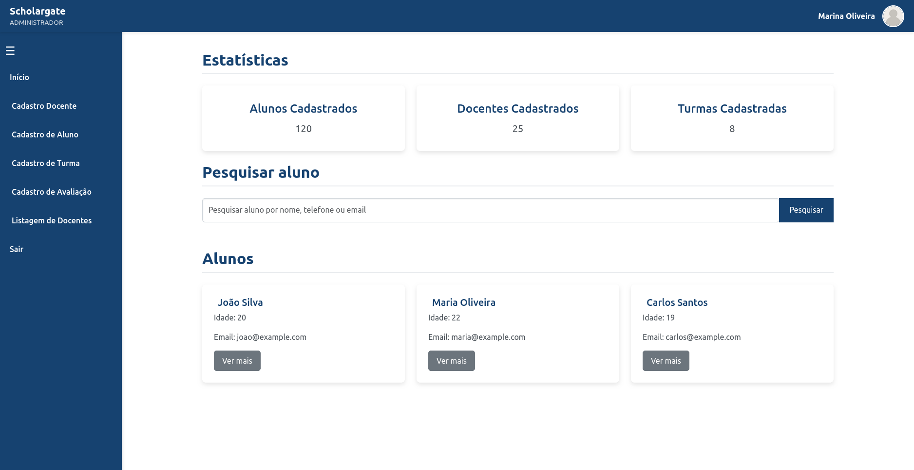

_(English version | [Click here for the Portuguese version.](https://github.com/barbaracalderon/scholargate/blob/main/src/assets/README-pt.md))_

# Scholargate

Scholargate is an academic management system developed using Angular, Bootstrap, CSS, standalone components, and Local Storage for data persistence. This project provides an accessible platform for administrators, teachers, and students, each with specific functionalities and permissions.

This project is developed using HTML, CSS, JavaScript, Bootstrap, and localStorage for data storage. This is part of an individual activity within the Fullstack course curriculum at SENAI/SC by Lab365. The content displayed is in Portuguese-BR language.


## Author

Barbara Calderon, software developer.

- [Github](https://www.github.com/barbaracalderon)
- [LinkedIn](https://www.linkedin.com/in/barbaracalderondev)
- [Twitter](https://www.x.com/bederoni)

## Table of Features

| **Feature**               | **Description**                                                                                                                                              |
|---------------------------|--------------------------------------------------------------------------------------------------------------------------------------------------------------|
| **Authentication**        | **Login**: Supports different user roles (ADMIN, TEACHER, STUDENT) to log into the system. <br> **Personalized Homepage**: Dynamically adjusts homepage content based on the user role, showing relevant information. |
| **Dynamic Sidebar Menu**  | The sidebar adapts to the logged-in user role, offering quick access to specific functionalities.                                                             |
| **Toolbar**               | A fixed toolbar at the top of the page enables navigation and access to key information.                                                                      |
| **Homepage**              | Provides an overview tailored to the logged-in user, displaying relevant information based on their role (ADMIN, TEACHER, STUDENT).                           |
| **Student Registration**  | A page for registering new students, including personal and academic details.                                                                                 |
| **Grade Entry**           | A page where teachers can enter student grades for various subjects.                                                                                          |
| **Teacher Registration**  | Allows administrators to register new teachers with all required details.                                                                                      |
| **Class Registration**    | A page for registering classes and associating them with specific teachers and subjects.                                                                      |
| **Teacher Listing**       | Displays a list of all registered teachers, allowing administrators to manage their information.                                                              |
| **Student Grades Listing**| Shows all grades recorded for a specific student, accessible by both teachers and students.                                                                   |




## Technologies Used

- **Angular:** Main framework for frontend development.
- **Bootstrap:** Used for styling and creating responsive layouts.
- **CSS:** For additional customization and personalized styling.
- **Standalone Components:** Angular's modular structure for better organization and reusability.
- **Local Storage:** Client-side data storage for persisting information without a backend.

## Project Structure

- **src/app/components:** Contains all project components, organized by functionality.
- **src/app/services:** Services managing business logic and interactions with Local Storage.
- **src/app/models:** Data model definitions used throughout the project.
- **src/assets:** Static files, such as images and icons.

## Installation and Execution

### Prerequisites
- Node.js
- Angular CLI

### Steps to Run the Project Locally

1. Clone the repository:
   ```bash
   git clone https://github.com/your-username/scholargate.git

2. NNavigate to the project directory:

    ```
    cd scholargate
    ```

3. Install dependencies:

    ```
    npm install
    ```

4. Run the project:

    ```
    ng serve
    ```

5. Access the project in the browser:

    ```
    http://localhost:4200
    ```

### Mock Users

The project includes mock user data for login:

```typescript
    const usersMock = [
        { 
            email: 'admin@scholargate.com',
            password: 'admin123',
            role: 'ADMINISTRADOR',
            name: 'Marina Oliveira' 
        },
        { 
            email: 'docente@scholargate.com', 
            password: 'docente123', 
            role: 'DOCENTE', 
            name: 'Otávio Queiroz' 
        },
        { 
            email: 'aluno@scholargate.com', 
            password: 'aluno123', 
            role: 'ALUNO', 
            name: 'Pedro Torres' 
        }
    ];
```
## Contributions
Contributions are welcome. If you have suggestions, improvements, or bug fixes, feel free to open an issue or submit a pull request.

Regards, 

Barbara Calderon.
